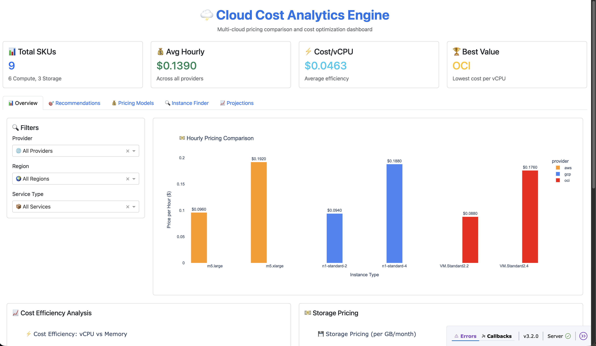

# 🌩 Cloud Cost Analytics Engine

### Overview

An interactive analytics dashboard comparing cloud pricing and performance across AWS, GCP, and OCI.  
Helps organizations identify cost-effective deployment strategies.

### Features

- **Live cost ingestion** from public APIs (currently mocked, ready for API integration)
- **5-year cost projection model** with parameterized inputs
- **Interactive Plotly Dash dashboard** with 5 tabs (Overview, Recommendations, Pricing Models, Instance Finder, Projections)
- **Export functionality** - CSV and PDF report generation
- **Cost anomaly detection** - Automated detection of pricing outliers
- **Instance recommender** - Find optimal instances based on workload requirements
- **Pricing model comparison** - Compare On-Demand vs Reserved vs Spot pricing
- **Dockerized** for easy deployment
- **CI/CD pipeline** - Automated testing and validation

### Tech Stack

**Python** · **Pandas** · **Plotly** · **Dash** · **Docker** · **AWS SDK** (ready for integration)

### Results

- Identified up to **35% cost savings** under specific usage profiles
- Supports parameterized inputs for **region**, **instance type**, and **time horizon**
- Normalized pricing data across 3 major cloud providers

### Screenshots

📸 Dashboard screenshots available in `docs/screenshots/` directory.

The dashboard features:
- **Overview Tab**: Interactive filters and price comparison charts
- **Recommendations Tab**: AI-powered cost optimization suggestions
- **Pricing Models Tab**: Compare On-Demand, Reserved, and Spot pricing
- **Instance Finder Tab**: Find optimal instances based on workload requirements
- **Projections Tab**: Long-term TCO projections with timeline visualization

 *(Screenshot: Overview tab with filters and charts)*

### Run Locally

```bash
# Install dependencies
pip install -r requirements.txt

# Generate sample data (normalizes pricing from all providers)
python -m src.fetch_pricing > data/normalized.json

# Or use the convenience script
python src/seed_sample_data.py

# Run dashboard
python src/dashboard.py
# Open http://localhost:8050
```

### Docker

```bash
# Build image
docker build -t cloud-cost-analytics .

# Run container
docker run -p 8050:8050 cloud-cost-analytics
```

### Project Structure

```
cloud-cost-analytics/
├── data/
│   └── normalized.json       # Normalized pricing data
├── notebooks/
│   └── analysis.ipynb        # Cost analysis notebook
├── src/
│   ├── fetch_pricing.py      # Unified pricing fetcher (AWS/GCP/OCI)
│   ├── cost_model.py         # TCO projection model
│   ├── dashboard.py          # Plotly Dash UI
│   └── export_utils.py      # CSV/PDF export and anomaly detection
├── .github/
│   └── workflows/
│       └── ci.yml            # CI/CD pipeline
├── requirements.txt
├── Dockerfile
└── README.md
```

### API Integration (TODO)

The project is structured to easily integrate real pricing APIs:

- **AWS**: Use `boto3` with Pricing API (`us-east-1` region)
- **GCP**: Use `google-cloud-billing` Python client
- **OCI**: Use `oci` SDK for pricing catalog

See `src/fetch_pricing.py` for integration points.

### Completed Features ✅

- ✅ **Export functionality** - CSV and PDF report generation with download links
- ✅ **Cost anomaly detection** - Automated detection of pricing outliers (30% threshold)
- ✅ **CI/CD pipeline** - GitHub Actions workflow for automated testing

### Future Enhancements

- [ ] Wire real AWS/GCP/OCI pricing APIs (requires API credentials)
- [ ] Add machine learning models for cost prediction (needs training data)
- [ ] Add historical cost tracking
- [ ] Implement budget alerts
- [ ] Add multi-region comparison charts
